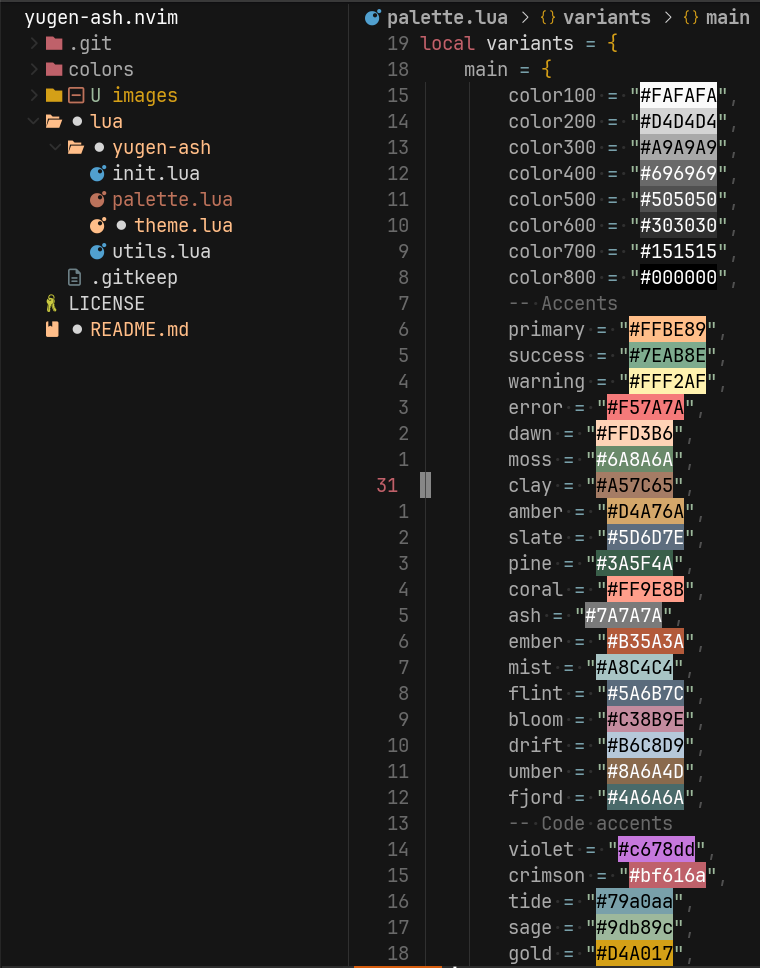
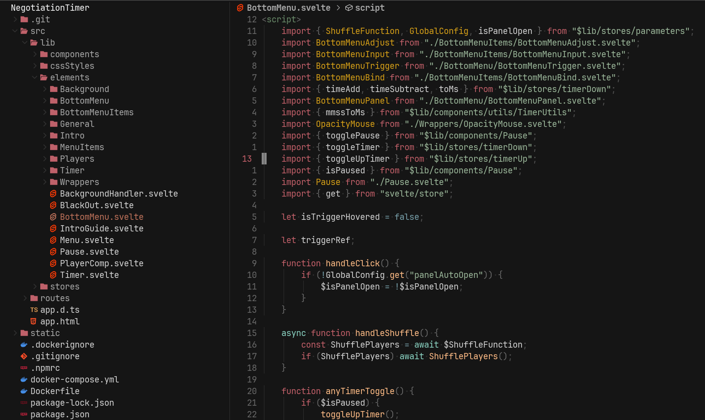
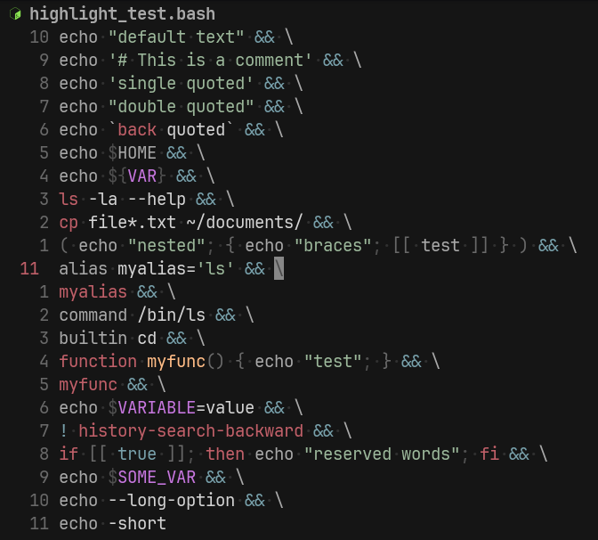
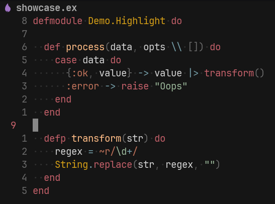

# yugen-ash

A dark theme for nvim.

## Showcase

<table>
  <tr>
    <td align="center"></td>
    <td align="center"></td>
  </tr>
  <tr>
    <td align="center"></td>
    <td align="center"></td>
  </tr>
</table>

# Palette

```lua
placeholder = "#303030"
color100 = "#fafafa"
color200 = "#d4d4d4"
color300 = "#a9a9a9"
color400 = "#696969"
color500 = "#505050"
color600 = "#303030"
color700 = "#151515"
color800 = "#000000"
-- accents
primary = "#ffbe89"
success = "#7eab8e"
warning = "#fff2af"
error = "#f57a7a"
dawn = "#ffd3b6"
moss = "#6a8a6a"
clay = "#a57c65"
amber = "#d4a76a"
slate = "#5d6d7e"
pine = "#3a5f4a"
coral = "#ff9e8b"
ash = "#7a7a7a"
ember = "#b35a3a"
mist = "#a8c4c4"
flint = "#5a6b7c"
bloom = "#c38b9e"
drift = "#b6c8d9"
umber = "#8a6a4d"
fjord = "#4a6a6a"
-- code accents
violet = "#c678dd"
crimson = "#bf616a"
tide = "#79a0aa"
sage = "#9db89c"
gold = "#d4a017"
seafoam = "#8dd3c3"
rust = "#bc735c"
frost = "#96a8ad"
```

## Installation

[lazy.nvim](https://github.com/folke/lazy.nvim):

```lua
{
    "qfioofa/yugen-ash.nvim"
    lazy = false
    priority = 1000
}
```

Fast integration

```lua
{
    "qfioofa/yugen-ash.nvim"
    lazy = false
    priority = 1000
    config = function()
        vim.cmd("colorscheme yugen-ash")
    end
}
```

[packer.nvim](https://github.com/wbthomason/packer.nvim):

```lua
use { "qfioofa/yugen-ash.nvim" }
```

## Usage

```lua
vim.cmd("colorscheme yugen-ash")
```

# Credits

This scheme based on 2 other schemes:
[yugen](https://github.com/bettervim/yugen.nvim)
[ash.nvim](https://github.com/drewxs/ash.nvim)
